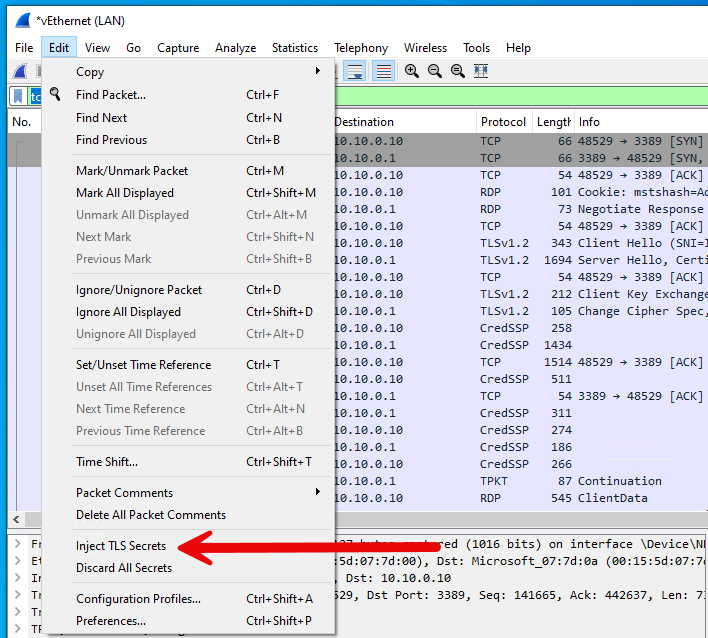

# Wireshark RDP resources

Looking for a way to capture and inspect RDP traffic in Wireshark? You've come to the right place!

## SSLKEYLOGFILE

Many applications, including browsers, support the SSLKEYLOGFILE environment variable with a path to a text file where TLS pre-master secrets are dumped. This format [is supported by Wireshark](https://wiki.wireshark.org/TLS#using-the-pre-master-secret) and does not require exporting server private keys.

To configure Wireshark to use a specific TLS key log file, open the **Preferences** dialog (Edit -> Preferences), navigate to the **TLS** section under **Protocols**, and then change the **(Pre)-Master-Secret log filename** field:


### SChannel

This technique involves attaching to lsass.exe in order to dump TLS pre-master secrets from SChannel into the SSLKEYLOGFILE format supported by Wireshark. This is by far the simplest approach so it's absolutely worth the trouble, but it should only be used in test environments where security features can be disabled.

Follow these instructions using an *elevated* [PowerShell 7](https://learn.microsoft.com/en-us/powershell/scripting/install/installing-powershell-on-windows) terminal (Windows PowerShell is *not* compatible).

Disable [LSA extended protection](https://learn.microsoft.com/en-us/windows-server/security/credentials-protection-and-management/configuring-additional-lsa-protection#how-to-disable-lsa-protection), and then reboot the machine:

```PowerShell
Set-ItemProperty -Path 'HKLM:\SYSTEM\CurrentControlSet\Control\Lsa' -Name 'RunAsPPL' -Value 0
```

Install [PSDetour](https://github.com/jborean93/PSDetour):

```PowerShell
Install-Module -Name PSDetour -Scope AllUsers -Force
```

Launch tls-lsa-dump.ps1:

```PowerShell
.\tls-lsa-dump.ps1
```

By default, the script will use `C:\Windows\Temp\tls-lsa.log` as the SSLKEYLOGFILE. Make sure that Wireshark is properly configured to use it, then capture a first RDP connection to see if it works!

## Wireshark Issues

You thought this was the end of it? Not so fast!

### RDP traffic shows up as 'TPKT Continuation'

Wireshark associates TCP/3389 with the TPKT dissector by default, which works for the [X.224 connection request](https://learn.microsoft.com/en-us/openspecs/windows_protocols/ms-rdpbcgr/902b090b-9cb3-4efc-92bf-ee13373371e3)/[confirm](https://learn.microsoft.com/en-us/openspecs/windows_protocols/ms-rdpbcgr/13757f8f-66db-4273-9d2c-385c33b1e483) packets that happen before the TLS handshake.

For some reason, the TPKT dissector often won't handoff the TLS packets to the TLS dissector, causing the 'TPKT Continuation' issue. When this happens, right-click on one of the RDP packets, then select **Decode As...":


In the Wireshark **Decode As..** dialog, change the default or current dissector to **TLS** then click OK:


With the TLS dissector forced on the entire TCP connection, the X.224 packets will show up as 'Ignored Unknown Record', but you should now be able to see the TLS handshake, and hopefully some RDP decrypted packets!


To get a cleaner view of the RDP traffic without TCP and TLS packets, add "rdp" to the current Wireshark filter.


## Noise Reduction

Some RDP features can make packet captures messy and harder to analyze, some Windows features can create unwanted background noise, requiring more advanced filtering to keep only the relevant traffic.

### RDP UDP Transport

Unless you intend to work on the RDP UDP protocol itself, I highly recommend disabling RDP UDP to get a single, clean RDP TCP connection:

```PowerShell
Set-ItemProperty -Path 'HKLM:\SOFTWARE\Policies\Microsoft\Windows NT\Terminal Services\Client' -Name 'fClientDisableUDP' -Value 1
```

Even if you block RDP UDP traffic in the firewall, you will still get some noise from the [RDP multitransport extension](https://learn.microsoft.com/en-us/openspecs/windows_protocols/ms-rdpemt/4d98f550-6b0d-4d5f-89f5-2ac8616246a2) over the primary RDP TCP connection.

## Bandwidth Auto-Detection

Bandwidth auto-detection is *VERY* noisy at the beginning of an RDP connection - disable it at all costs in your [.RDP file](https://learn.microsoft.com/en-us/windows-server/remote/remote-desktop-services/clients/rdp-files):

```
connection type:i:6
networkautodetect:i:0
bandwidthautodetect:i:0
```

Network auto-detection is connection type 7 (auto-detect), which is when bandwidth auto-detection would kick in. This is why disabling the feature completely is best done by setting an explicit network type (6 for LAN), and then disabling both network and bandwidth auto-detection. If you're confused, you're not alone.

## Bulk Data Compression

RDP bulk data compression is great everywhere except when you want to inspect the packets. Disable compression by adding `compression:i:0` to your [.RDP file](https://learn.microsoft.com/en-us/windows-server/remote/remote-desktop-services/clients/rdp-files):

```
compression:i:0
```

### Windows SmartScreen

If you're inspecting HTTP traffic alongside the RDP connection (think Azure AD, Azure Virtual Desktop, RD Gateway, etc) then you'll want to remove some of the background noise by disabling SmartScreen:

```PowerShell
Set-ItemProperty -Path 'HKLM:\SOFTWARE\Policies\Microsoft\Windows\System' -Name 'EnableSmartScreen' -Type DWORD -Value 0
```

Don't forget to close unused browsers, and Windows *should* be quiet enough!

## FreeRDP

The latest version of [FreeRDP](https://github.com/FreeRDP/FreeRDP) accepts SSKEYLOGFILE as a command-line parameter:

```
/tls:secrets-file:</path/to/freerdp-tls.keys>
```

It is recommended to build FreeRDP from source, as prebuilt versions of FreeRDP in Linux distributions are unlikely to have this option.

## IronRDP

The [IronRDP](https://github.com/Devolutions/IronRDP) desktop client accepts the SSKEYLOGFILE environment variable:

```PowerShell
$Env:SSLKEYLOGFILE="C:\path\to\ironrdp-tls.keys"
```

IronRDP is still in active development, so check for updates frequently!

## Capture Exporting

Make sure you have correctly set up Wireshark with a TLS pre-master secret file used by the RDP client you wan to capture traffic from. Start the capture, launch a connection, then stop the capture. Apply a simple filter like `tcp.port == 3389`, then right-click on any of the RDP packets and use **Follow** -> **TCP Stream**:


Wireshark should now show only a single RDP TCP connection with TLS traffic decrypted, and all unrelated traffic removed.

Next, use **Edit** -> **Inject TLS Secrets** to inject the TLS secrets from the currently loaded TLS pre-master secret file into the capture file:



Export the filtered, decrypted capture using **File** -> **Export Specified Packets..**. In the export dialog, select **Displayed** instead of **Captured**, and save the capture in the newer pcapng format, not the older pcap format (very important!).

Alternatively, you can inject TLS secrets into an existing .pcapng file using the [editcap command-line tool](https://www.wireshark.org/docs/man-pages/editcap.html):

```PowerShell
$CaptureName = "rdp-test" # change this
$Env:PATH += ";$Env:ProgramFiles\Wireshark"
& editcap --inject-secrets "tls,${CaptureName}.keys" "${CaptureName}.pcapng" "${CaptureName}-tls.pcapng"
@("${CaptureName}.pcapng", "${CaptureName}.keys") | Remove-Item
Move-Item "${CaptureName}-tls.pcapng" "${CaptureName}.pcapng"
```

Congratulations, you now have a Wireshark capture file with RDP traffic that you can easily share with anyone and that will decrypt properly!
